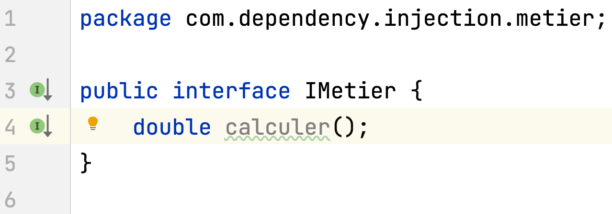

# Séance 1 : Inversion de contrôle et Injection des dépendances (Fichier de configuration)

## 1- Créer l'interface IDao :

## 2- Créer une implémentation de cette interface :

## 3- Créer l'interface IMetier :

## 4- Créer une implémentation de cette interface en utilisant le couplage faible :

## 5- Faire l'injection des dépendances :

### a- Par instanciation statique :

### b- Par instanciation dynamique :

 

