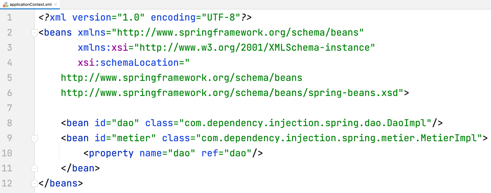

# Séance 2 : Inversion de contrôle et Injection des dépendances (En utilisant le Framework Spring)

## c- En utilisant le Framework Spring :

### - Version XML :

### - Version annotations :

 

 

